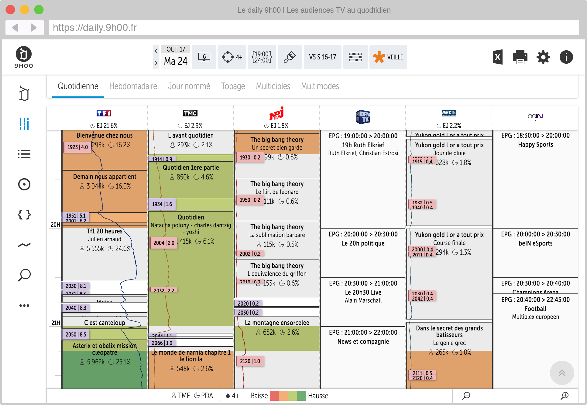

test-react : le test technique React de Daily d'initiés
=============

**Le but de cet exercice est de représenter les données contenues dans le fichier `/src/stores/GridData.js` sous la forme d'une grille des programmes consultable dans le navigateur Chrome en réalisant un composant React.**


## Contexte métier

Une grille des programmes est une représentation des programmes TV diffusés pendant une journée. Les chaînes de TV sont en colonnes et les programmes sont représentées sous formes de cases dont la taille est proportionnelle à leur durée. Cet exemple est donné à titre indicatif :




## Installation de l'application "test-react"

Commencez par forker ce repository vers votre compte github.
Exécutez les instructions suivantes dans un terminal pour récupérer le code source de `test-react` et démarrer l'application.

```
# Clone du repository
git clone https://github.com/[votre_compte]/test-react.git

# Installation des dépendances
cd test-react
npm install

# Lancement de l'application
npm run dev
```
Il est désormais possible d'accéder à l'application depuis un navigateur en se connectant à l'adresse `http://localhost:3000/`


## Contexte technique

L'application utilise les frameworks React et Fluxible, le code est écrit en javascript ES6, jsx et sass.
Parmi les fichiers, vous interagirez sans doute avec les suivants :

- `/src/components/Grid.js` : composant grille à développer (controller en js et vue en jsx)
- `/src/style/Grid.scss` : feuille de style du composant grille (en sass)
- `/src/stores/GridData.js` : source de données à mettre en forme
- `/src/stores/GridStore.js` : store mettant le contenu de `GridData.js` à disposition du component `Grid.js`
- `/src/actions/GridAction.js` : action permettant au component `Grid.js` d'interagir avec `GridStore.js`


## Structure du fichier GridData.js

### Racine

- `day` jounée sur laquelle nous travaillons (au  format `YYYY-MM-DD`)
- `startTime` heure de début de la grille (en secondes)
- `endTime` heure de fin de la grille (en secondes)
- `chns` tableau de 4 chaines

A noter que par convention, la journée télé commence à 3h00 du matin et finit à 26h59 (en fait 2h59 le lendemain)

### chns

- `chnName` nom de la chaîne
- `shows` tableau d'émissions

### shows

- `startTime` heure de début de l'émission (en secondes)
- `endTime` durée de l'émission (en secondes)
- `title` titre de l'émission
- `subTitle` sous-titre de l'émission (vaut `null` si l'émission n'a pas de sous-titre)
- `pda` part d'audience du programme